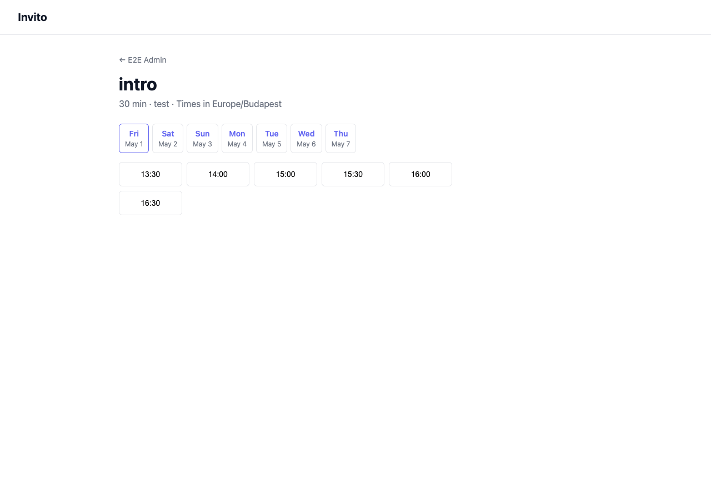

# Invito

A lightweight, self-hosted scheduling tool. Give guests a link — they pick a time that works for both of you.



Invito connects to your existing CalDAV calendars to find open slots and blocks time when a booking is confirmed. No cloud lock-in, no monthly fee.

## Features

- **CalDAV integration** — connects to any CalDAV server (Nextcloud, iCloud, Google Calendar via DAV, etc.)
- **Multiple event types** — define different meeting kinds with fixed durations (e.g. "30-min intro call", "1-hour consultation")
- **Public booking pages** — share a link; guests book without needing an account
- **Embeddable widget** — embed the booking picker as an iframe on any website
- **Pending approval** — every booking request waits for your confirmation before being added to your calendar
- **Email notifications** — accept or reject bookings directly from your inbox
- **OIDC login** — no separate user database; plug in your existing identity provider
- **Single binary** — deploy with one file and an SQLite database

## Quick Start

### Requirements

- Go 1.22+
- An OIDC provider (Keycloak, Authentik, Dex, GitHub, Google, …)
- A CalDAV server
- An SMTP server

### Run with Docker

```bash
docker run -d \
  -e INVITO_BASE_URL=https://invito.example.com \
  -e INVITO_OIDC_ISSUER=https://auth.example.com/realms/main \
  -e INVITO_OIDC_CLIENT_ID=invito \
  -e INVITO_OIDC_CLIENT_SECRET=secret \
  -e INVITO_SMTP_HOST=smtp.example.com \
  -e INVITO_SMTP_FROM=invito@example.com \
  -e INVITO_SESSION_SECRET=replace-with-32-byte-hex \
  -v invito-data:/data \
  ghcr.io/jeboehm/invito:latest
```

### Build from source

```bash
git clone https://github.com/jeboehm/invito.git
cd invito
go build -o invito ./cmd/invito
INVITO_BASE_URL=http://localhost:8080 ./invito
```

See [Getting Started](https://jeboehm.github.io/invito/tutorials/getting-started/) for a full walkthrough.

## Documentation

| Type                                                                                        | Content                                               |
| ------------------------------------------------------------------------------------------- | ----------------------------------------------------- |
| [Tutorial](https://jeboehm.github.io/invito/tutorials/getting-started/)                     | Step-by-step: from install to first confirmed booking |
| [How-to: Add a calendar](https://jeboehm.github.io/invito/how-to/add-calendar/)             | Connect a CalDAV calendar                             |
| [How-to: Create an event type](https://jeboehm.github.io/invito/how-to/create-event-type/)  | Define a new meeting kind                             |
| [How-to: Set your availability](https://jeboehm.github.io/invito/how-to/set-availability/)  | Configure recurring weekly office hours               |
| [How-to: Share a booking link](https://jeboehm.github.io/invito/how-to/share-booking-link/) | Send guests a link                                    |
| [How-to: Manage bookings](https://jeboehm.github.io/invito/how-to/manage-bookings/)         | View and filter booking requests                      |
| [How-to: Set up your profile](https://jeboehm.github.io/invito/how-to/set-up-profile/)      | Configure username and timezone                       |
| [How-to: Embed a booking widget](https://jeboehm.github.io/invito/how-to/embed-widget/)     | Add an iframe booking picker to your website          |
| [Explanation: Architecture](https://jeboehm.github.io/invito/explanation/architecture/)     | Design decisions and system overview                  |
| [Explanation: Data model](https://jeboehm.github.io/invito/explanation/data-model/)         | Entities and relationships                            |
| [Explanation: Booking flow](https://jeboehm.github.io/invito/explanation/booking-flow/)     | How a booking moves from request to confirmation      |
| [Reference: Configuration](https://jeboehm.github.io/invito/reference/configuration/)       | All environment variables                             |
| [Reference: HTTP API](https://jeboehm.github.io/invito/reference/api/)                      | All routes and their behavior                         |

## Contributing

Contributions are welcome. Please read [CONTRIBUTING.md](CONTRIBUTING.md) before opening a pull request.

## License

MIT — see [LICENSE](LICENSE).
