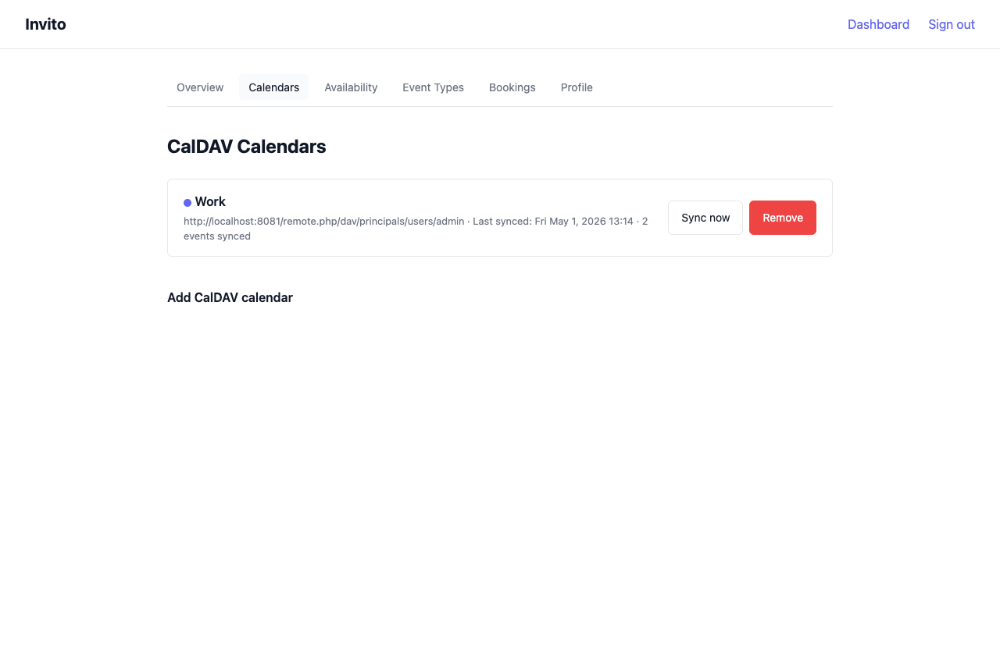

# How to Add a CalDAV Calendar

This guide explains how to connect a CalDAV calendar to Invito so that it is included in your free/busy calculation.

## Prerequisites

- You are logged in to your Invito dashboard.
- You have a CalDAV server URL and credentials.

## Finding your CalDAV URL

The CalDAV URL format varies by provider:

| Provider  | URL format                                                                           |
| --------- | ------------------------------------------------------------------------------------ |
| Nextcloud | `https://nextcloud.example.com/remote.php/dav/calendars/{username}/{calendar-name}/` |
| Radicale  | `https://radicale.example.com/{username}/{calendar-name}/`                           |
| Baikal    | `https://baikal.example.com/cal.php/calendars/{username}/{calendar-name}/`           |
| iCloud    | `https://caldav.icloud.com/{account-id}/calendars/{calendar-name}/`                  |
| Google    | `https://www.google.com/calendar/dav/{calendar-id}/events/`                          |

If you are unsure of the exact URL, your CalDAV client (e.g. Thunderbird, Apple Calendar) typically shows it in the calendar's settings.

## Steps

1. Go to **Dashboard → Calendars**.
2. Click **Add calendar**.
3. Fill in the form:
   - **CalDAV URL** — the collection URL for your calendar.
   - **Username** — your CalDAV username (often your email address).
   - **Password** — your CalDAV password or app-specific password.
   - **Display name** — a label for the calendar in the Invito UI (e.g. "Work", "Personal").
   - **Color** (optional) — for visual distinction in the dashboard.
4. Click **Connect**.

Invito immediately performs a PROPFIND request to verify the credentials. If the connection fails, an error message is shown with the reason.

On success, an initial sync runs in the background. Within a few seconds, your calendar events appear in the sync log.

## Notes

- **App-specific passwords:** Some providers (iCloud, Google) require an app-specific password rather than your account password. Generate one in your provider's security settings.
- **Multiple calendars:** You can connect multiple CalDAV calendars. All connected calendars contribute to free/busy — a slot is only shown as available if it is free on all synced calendars.
- **Sync interval:** Invito polls for changes every `INVITO_SYNC_INTERVAL` (default: 15 min). To trigger an immediate sync, click **Sync now** next to the calendar.
- **Primary calendar:** The first calendar you add is used for write-back (confirmed bookings are created there). You can change the primary calendar in the calendar list.

## Removing a calendar

1. Go to **Dashboard → Calendars**.
2. Click **Remove** next to the calendar you want to disconnect.
3. Confirm the deletion.

Invito removes the calendar and all its cached events. Existing confirmed bookings are not affected, but the corresponding CalDAV event (if created) is not deleted from the remote server.
