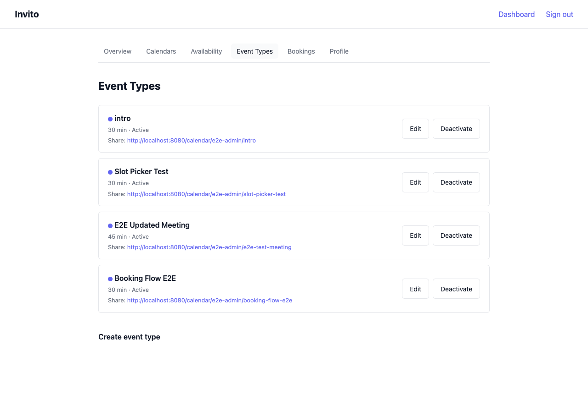

# How to Create an Event Type

An event type defines a named, fixed-duration meeting kind that guests can book.

 You can have multiple event types — for example, a short intro call and a longer working session.

## Prerequisites

- You are logged in to your Invito dashboard.
- You have set your availability (Dashboard → Availability). Without availability rules, no slots are generated.

## Steps

1. Go to **Dashboard → Event Types**.
2. Click **New event type**.
3. Fill in the form:

   | Field              | Description                                            | Example                                    |
   | ------------------ | ------------------------------------------------------ | ------------------------------------------ |
   | **Title**          | Displayed on the booking page                          | `30-min intro call`                        |
   | **Slug**           | URL segment. Lowercase letters, numbers, hyphens only. | `intro`                                    |
   | **Description**    | Optional. Shown to guests before they pick a slot.     | `A quick call to see if we're a good fit.` |
   | **Duration**       | Fixed meeting length in minutes.                       | `30`                                       |
   | **Color**          | Visual label in the dashboard.                         | `#6366f1`                                  |
   | **Booking window** | How many days into the future guests can book.         | `60`                                       |

4. Click **Create**.

Your event type is now live. The public URL is:

```
https://invito.example.com/{your-username}/{slug}
```

## Editing an event type

1. Go to **Dashboard → Event Types**.
2. Click **Edit** next to the event type.
3. Modify the fields and click **Save**.

The edit form includes two additional fields not available during creation:

| Field                 | Description                                                                             |
| --------------------- | --------------------------------------------------------------------------------------- |
| **Confirmed message** | Text included in the confirmation email sent to the guest when you confirm the booking. |
| **Rejected message**  | Text included in the rejection email sent to the guest when you reject the booking.     |

**Note:** Changing the slug changes the public URL. Any links you have already shared will stop working.

## Disabling an event type

If you want to temporarily stop accepting bookings for a specific event type without deleting it:

1. Go to **Dashboard → Event Types**.
2. Click **Disable** next to the event type.

The event type is hidden from your public booking page. Existing bookings are not affected. Re-enable it at any time by clicking **Enable**.

## Deleting an event type

Deleting an event type is permanent. All associated bookings (including history) are also deleted.

1. Go to **Dashboard → Event Types**.
2. Click **Edit** → **Delete event type**.
3. Confirm.

If you want to keep the booking history, disable the event type instead.
