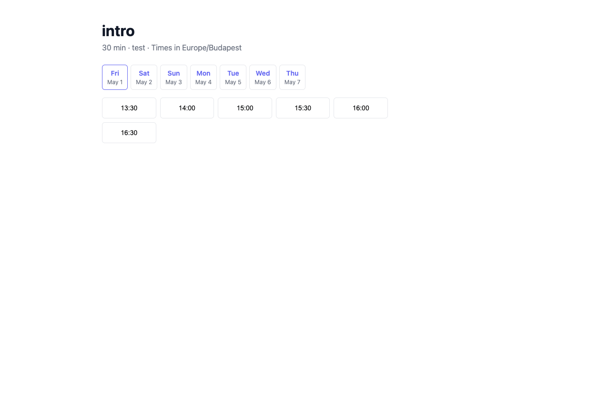

# How to Embed a Booking Widget

Invito provides a widget version of the booking picker that can be embedded as an iframe on any external website — a personal site, a landing page, or an internal tool.



## Widget URL

The widget URL for a specific event type is:

```
https://invito.example.com/widget/{username}/{slug}
```

Replace `invito.example.com` with your Invito base URL, `{username}` with your username, and `{slug}` with your event type slug.

You can find both your username and event type slugs under **Dashboard → Event Types**.

## Embedding as an iframe

Add the following HTML to your page:

```html
<iframe
  src="https://invito.example.com/widget/{username}/{slug}"
  width="100%"
  height="700"
  frameborder="0"
  style="border: none; border-radius: 8px;"
>
</iframe>
```

Adjust `width` and `height` to fit your page layout. A minimum height of 600px is recommended to show the date picker and slot list without scrolling.

## How the widget differs from the standard booking page

|                      | Standard booking page         | Widget                              |
| -------------------- | ----------------------------- | ----------------------------------- |
| URL                  | `/calendar/{username}/{slug}` | `/widget/{username}/{slug}`         |
| Embeddable in iframe | No (X-Frame-Options: DENY)    | Yes (X-Frame-Options: ALLOWALL)     |
| CSRF protection      | Yes                           | No (stateless; no cookies required) |
| Navigation chrome    | Full page header/footer       | Minimal layout                      |

The widget uses a separate HTTP multiplexer internally, which is why the security headers differ. The booking logic — slot calculation, conflict checking, email notifications — is identical to the standard flow.

## Notes

- **No separate event type needed:** You use the same event types for both the widget and the standard booking page.
- **Booking confirmation flow:** After a guest submits a booking via the widget, they see a confirmation message inside the iframe. The host confirmation/rejection emails work the same as for standard bookings.
- **Styling:** The widget uses Invito's default styling. There is currently no theming API.
