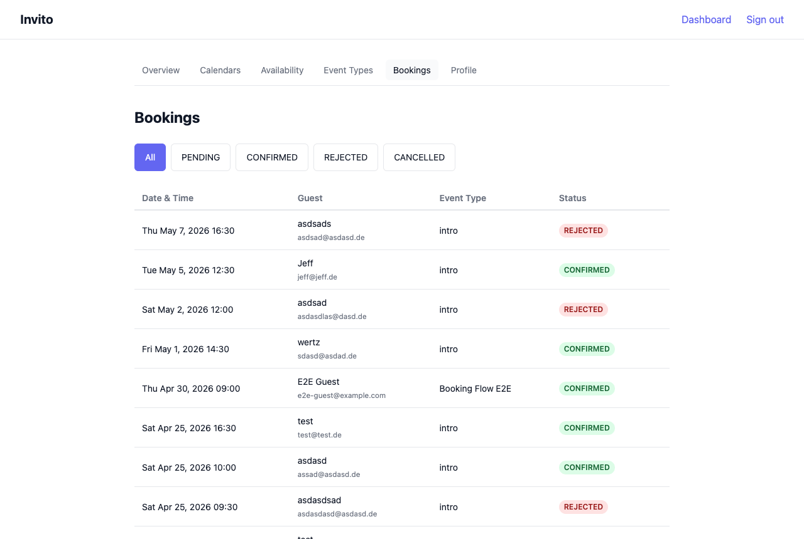

# How to Manage Bookings

The bookings list gives you an overview of all booking requests across your event types. Use it to track pending requests and review your booking history.

## Prerequisites

- You are logged in to your Invito dashboard.

## Viewing bookings

1. Go to **Dashboard → Bookings**.

The list shows your most recent bookings ordered by meeting time (newest first), including:

- Guest name and email address
- Date and time of the meeting
- Event type
- Current status
- Any note the guest provided

## Filtering by status

Use the status filter at the top of the page to narrow the list:

| Status        | Meaning                                                      |
| ------------- | ------------------------------------------------------------ |
| **PENDING**   | Guest has submitted a request; waiting for your confirmation |
| **CONFIRMED** | You confirmed the booking; a calendar event has been created |
| **REJECTED**  | You rejected the booking via the email link                  |
| **CANCELLED** | The booking expired before you acted (TTL passed)            |

Click a status tab to filter, or select **All** to see every booking.

## Acting on pending bookings

You confirm or reject bookings via the email links sent to you when a guest books — you do not act on them through the dashboard. The dashboard is read-only and for reference only.

To receive the email again, ask the guest to rebook. There is currently no "resend notification" button.

## Automatic cancellation

PENDING bookings that are not acted on within the configured TTL (default: 24 hours, set by `INVITO_BOOKING_TTL`) are automatically moved to CANCELLED by a background process. A cancellation email is sent to the guest.
