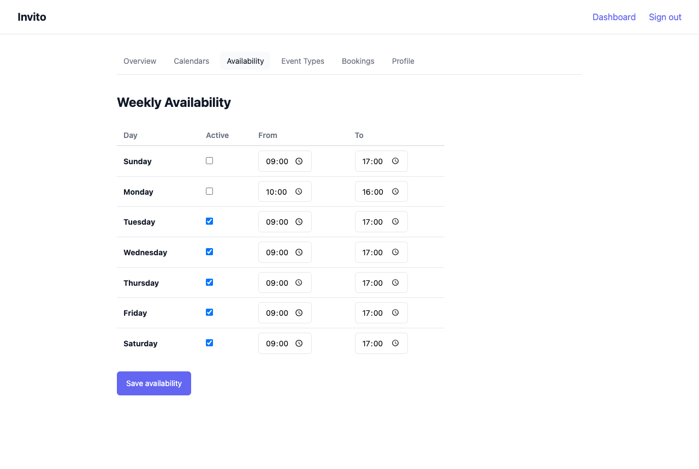

# How to Set Your Availability

Availability rules define when you are open for bookings on a recurring weekly basis. Invito uses these rules — combined with your synced calendar events — to calculate which time slots appear on your public booking page.

## Prerequisites

- You are logged in to your Invito dashboard.

## Steps

1. Go to **Dashboard → Availability**.
2. For each weekday you want to accept bookings, check the checkbox on that row.
3. Set the **Start time** and **End time** for each active day.
4. Click **Save**.

Your availability takes effect immediately for new slot calculations.

## Example

A user available Monday through Friday, 09:00–17:00, with a lunch break:

| Day      | Active | Start | End   |
| -------- | ------ | ----- | ----- |
| Monday   | ✓      | 09:00 | 12:00 |
| Monday   | ✓      | 13:00 | 17:00 |
| Tuesday  | ✓      | 09:00 | 12:00 |
| Tuesday  | ✓      | 13:00 | 17:00 |
| …        |        |       |       |
| Saturday | —      |       |       |
| Sunday   | —      |       |       |

To model a lunch break, add two rows for the same weekday: one before lunch and one after.

## Notes

- **Timezone:** Times are interpreted in the timezone you have set in your profile (Dashboard → Profile). Make sure your profile timezone matches your actual location.
- **Default:** If you save no availability rules, guests will see no available slots on your booking page.
- **Calendar conflicts still apply:** Availability rules define your theoretical open hours. Slots are further filtered by events already on your synced CalDAV calendars and by existing bookings.
- **No exception days:** Availability rules repeat every week. One-off blocked days (holidays, vacations) are handled by blocking time on your CalDAV calendar — Invito will read those blocks during sync and hide the overlapping slots.
