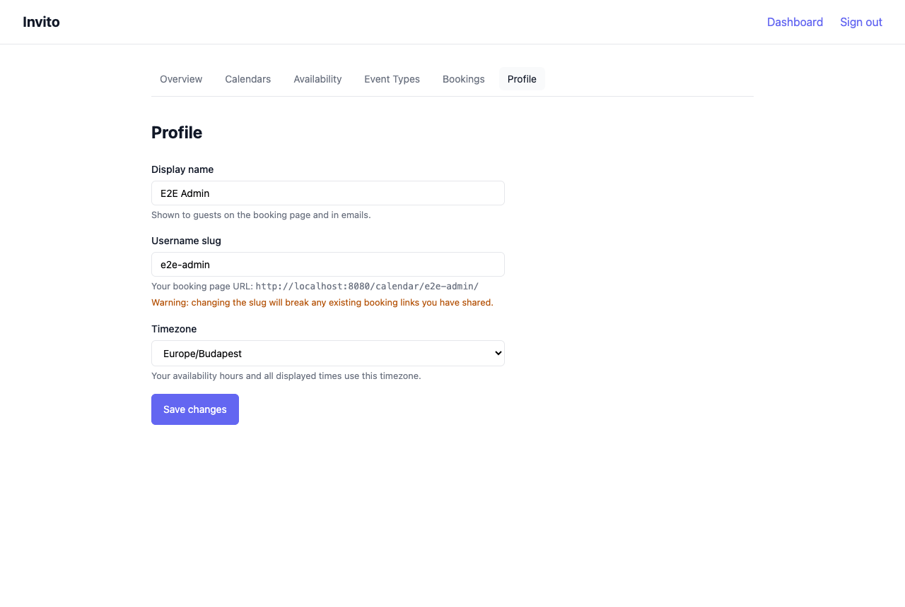

# How to Set Up Your Profile

Your profile controls your display name, the username that appears in your public booking URLs, and the timezone used for slot calculation and display.



## Prerequisites

- You are logged in to your Invito dashboard.

## Steps

1. Go to **Dashboard → Profile**.
2. Update the fields as needed:

   | Field            | Description                                                                        |
   | ---------------- | ---------------------------------------------------------------------------------- |
   | **Display name** | Your name as shown on booking pages. Defaults to the name from your OIDC provider. |
   | **Username**     | The URL slug for your booking page. See notes below.                               |
   | **Timezone**     | Your local timezone (IANA format, e.g. `Europe/Berlin`).                           |

3. Click **Save**.

## Username

Your username is the path segment used in all your booking URLs:

```
https://invito.example.com/calendar/{username}/
https://invito.example.com/calendar/{username}/{slug}
```

!!! warning
Changing your username changes all your booking URLs. Any links you have already shared will stop working. Guests who try the old URL will see a 404 page.

Usernames are auto-generated from your OIDC `preferred_username` claim on first login and must be unique across all Invito users.

## Timezone

The timezone affects:

- When slots are displayed on your booking page (guests see times in your timezone)
- How your availability rules are interpreted (the 09:00 start time in your rules means 09:00 in your configured timezone)

Choose the IANA timezone that matches your physical location. If you travel frequently, update this setting when you change regions.

## Your public booking URL

After saving, your profile page shows your public booking URL. Share this link to let anyone browse all your active event types and book a time.
