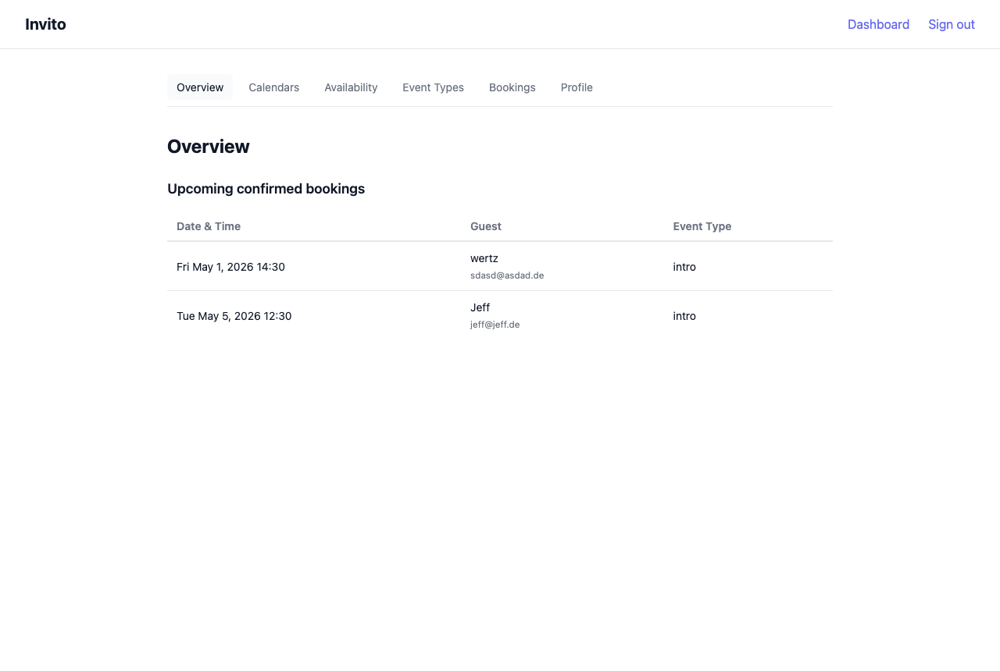

# Invito

A lightweight, self-hosted scheduling tool. Give guests a link — they pick a time that works for both of you.

Invito connects to your existing CalDAV calendars to find open slots and blocks time when a booking is confirmed. No cloud lock-in, no monthly fee.



## Features

- **CalDAV integration** — connects to any CalDAV server (Nextcloud, iCloud, Google Calendar via DAV, etc.)
- **Multiple event types** — define different meeting kinds with fixed durations (e.g. "30-min intro call", "1-hour consultation")
- **Public booking pages** — share a link; guests book without needing an account
- **Embeddable widget** — embed the booking picker as an iframe on any website
- **Pending approval** — every booking request waits for your confirmation before being added to your calendar
- **Email notifications** — accept or reject bookings directly from your inbox
- **OIDC login** — no separate user database; plug in your existing identity provider
- **Single binary** — deploy with one file and an SQLite database

## Quick Start

```bash
docker run -d \
  -e INVITO_BASE_URL=https://invito.example.com \
  -e INVITO_OIDC_ISSUER=https://auth.example.com/realms/main \
  -e INVITO_OIDC_CLIENT_ID=invito \
  -e INVITO_OIDC_CLIENT_SECRET=secret \
  -e INVITO_SMTP_HOST=smtp.example.com \
  -e INVITO_SMTP_FROM=invito@example.com \
  -e INVITO_SESSION_SECRET=replace-with-32-byte-hex \
  -v invito-data:/data \
  ghcr.io/jeboehm/invito:latest
```

See the [Getting Started tutorial](tutorials/getting-started.md) for a full walkthrough.

## Documentation

This documentation follows the [Diátaxis framework](https://diataxis.fr/):

| Type            | Content                                                                                   |
| --------------- | ----------------------------------------------------------------------------------------- |
| **Tutorial**    | [Getting Started](tutorials/getting-started.md) — from install to first confirmed booking |
| **How-to**      | [Connect a CalDAV calendar](how-to/add-calendar.md)                                       |
| **How-to**      | [Create an event type](how-to/create-event-type.md)                                       |
| **How-to**      | [Set your availability](how-to/set-availability.md)                                       |
| **How-to**      | [Share a booking link](how-to/share-booking-link.md)                                      |
| **How-to**      | [Manage bookings](how-to/manage-bookings.md)                                              |
| **How-to**      | [Set up your profile](how-to/set-up-profile.md)                                           |
| **How-to**      | [Embed a booking widget](how-to/embed-widget.md)                                          |
| **Reference**   | [Configuration](reference/configuration.md) — all environment variables                   |
| **Explanation** | [Architecture](explanation/architecture.md) — design decisions                            |
| **Explanation** | [Booking flow](explanation/booking-flow.md) — request to confirmation                     |
| **Explanation** | [Data model](explanation/data-model.md) — entities and relationships                      |
